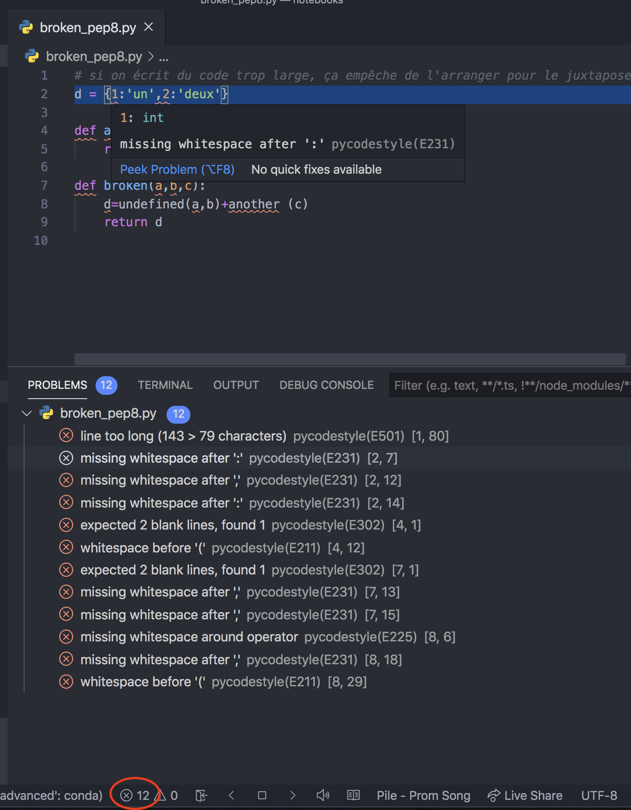

<div class="licence">
<span>Licence CC BY-NC-ND</span>
<span>Thierry Parmentelat</span>
<span></span>
</div>

+++

# présentation du code

+++ {"slideshow": {"slide_type": "slide"}}

## style de présentation du code

* tout le code de la librairie standard obéit à des règles de présentation
* elles ne sont pas imposées par le langage, **MAIS**
* elles sont très largement appliquées
* autant prendre de bonnes habitudes
* survol rapide ici des traits les plus marquants

+++ {"slideshow": {"slide_type": "slide"}}

## PEP-008

+++

ces règles de présentation sont explicitées dans [la note dite *PEP-008*](https://www.python.org/dev/peps/pep-0008/)

+++ {"cell_style": "split"}

OUI:

* `fonction(a, b, c)`
* `GLOBALE = 1000`
* lignes de longueur <= 80 caractères

+++ {"cell_style": "split"}

NON:

* ~~`fonction (a,b,c)`~~
* ~~`globale=1000`~~
* lignes très longues

+++

on va voir tout ça un peu plus en détail

+++ {"slideshow": {"slide_type": "slide"}}

## les espaces

+++

|  OUI  |  NON  |
|------------------|---------------|
| `a = 10` | ~~`a=10`~~ |
| `L = [1, 2, 3, 4]` | ~~`L = [1,2,3,4]`~~ |
| `D = ['k1': 'v1', 'k2': 'v2'}` | ~~`D = ['k1':'v1', 'k2' : 'v2'}`~~ |

+++

|  OUI  |  NON  |
|------------------|---------------|
| `def foo(a, b, c):` | ~~`def foo (a, b, c):`~~ | 
|                     | ~~`def foo(a,b,c):`~~ | 
| `res = foo(a, b, c)` | ~~`res = foo (a, b, c)`~~ |

+++

### les espaces...

+++

| **OUI** | **NON** |
|---------|---------|
| d = {1: 'un', 2: 'deux'} | ~~`d = {1:'un',2:'deux'}`~~ |
                           | ~~`d = { 1 : 'un', 2 : 'deux' }`~~ |
| s = {'a', 'b', 'c', 'd'} | ~~`s = {'a','b','c','d'}`~~ |
                           | ~~`s = { 'a' , 'b' , 'c' , 'd' }`~~ |

+++ {"slideshow": {"slide_type": "slide"}}

## les noms de variables

+++ {"cell_style": "split"}

| type d'objet | catégorie |
|------------------|---------------|
| variable usuelle | 1 | 
| fonction | 1 |
| module | 1 | 
| classe | 2 |

+++ {"cell_style": "split"}

| catégorie |  OUI  |  NON  |
|------|------------------|---------------|
| 1    | `minuscule` | ~~`MAJUSCULE`~~ |
| 1    | `deux_mots` | ~~`DeuxMots`~~  |
| 2    | `Mixte`     | ~~`minuscule`~~ (sauf types prédéfinis) |
| 2    | `DeuxMots`  | ~~`MAJUSCULE`~~ |

+++ {"slideshow": {"slide_type": "slide"}}

## largeur de la page

* dans sa version orthodoxe, la largeur de la page est limitée à 80 caractères
  en pratique aujourd'hui on peut être un peu plus souple,   
  mais **jamais > 100 caractères de large**
* l'idée est de pouvoir juxtaposer plusieurs codes (3 voire 4 )  
  dans la largeur d'un écran moderne
* on a parfois besoin de recourir à des astuces pour y arriver

+++ {"slideshow": {"slide_type": "slide"}}

### longueur des lignes

+++

plusieurs astuces pour respecter une largeur fixe :

```{code-cell} ipython3
# 1. utiliser les parenthèses

def foo():
    if expression(args):
        return (le_resultat() and de_l_expression() 
                and est_susceptible() and de_prendre()
                and beaucoup_de_place())
```

+++ {"slideshow": {"slide_type": "slide"}}

### longueur des lignes et parenthèses

```{code-cell} ipython3
# 2. ça marche aussi avec les {} et [] 

GLOBAL_MAP = [
    {'shortcut': 'ctrl-w', 'function': 'RISE:render-all-cells'},
    {'shortcut': 'ctrl-q', 'function': 'RISE:edit-all-cells'},
]
```

+++ {"slideshow": {"slide_type": "slide"}}

### longueur des lignes et chaines littérales

```{code-cell} ipython3
# 3. lorsqu'on a besoin de retourner des chaines de caractères très longues
# on peut utiliser un conjonction de
# * parenthèses
# * concaténation des chaines dans le source

def longue_chaine(nom, prenom):
    return (
        f"<table><thead><tr><th>Nom</th><th>Prénom</th></tr></thead>"
        f"<tbody><tr><td>{nom}</td><td>{prenom}</td></tr></tbody>"
        f"</table>"
    )
```

```{code-cell} ipython3
:cell_style: center

# astuce
# là on a produit du HTML, pour le voir rendu 
# dans le notebook

from IPython.display import HTML
HTML(longue_chaine("Jean", "Dupont"))
```

+++ {"slideshow": {"slide_type": "slide"}}

### longueur des lignes : éviter le `\`

+++

enfin il peut être utile de savoir qu'on peut 'échapper' les fins de ligne

```{code-cell} ipython3
# on **pourrait** écrire ça (sachez le lire) 
# mais je vous recommande de **ne pas faire comme ça**
# essayez par exemple d'ajouter un espace juste après un \ 
# ça ne se voit pas et pourtant ça fait tout planter

def foo():
    if expression(args):
        return le_resultat() and de_l_expression() \
                and est_susceptible() and de_prendre() \
                and beaucoup_de_place()
```

**les parenthèses, c'est mieux**  
dans l'exemple 1. on a le même code, mais avec les parenthèses on n'a pas cette fragilité

+++ {"slideshow": {"slide_type": "slide"}}

## fait partie des attendus

* ne pas parler le PEP008, c'est un peu  
  comme faire plein de fautes d'orthographe
* ça n'empêche pas d'avoir de bonnes idées  
  mais ça donne mauvaise impression
* faites-y attention à partir de maintenant 
* fait partie des critères pour l'évaluation

+++ {"slideshow": {"slide_type": "slide"}}

## de nombreux outils

+++ {"cell_style": "center"}

* très grand nombre d'outils de vérification de code Python
* du plus simple qui vérifie seulement *PEP008* - par exemple `flake8`
* au plus compliqué - genre `pylint` - qui peut trouver 
  * les erreurs de frappe dans les noms de variable
  * les imports inutiles

+++ {"slideshow": {"slide_type": "slide"}}

### command line 

+++

regardez du coté de 

* `autopep8` (sait *réparer* avec l'option `-i`)
* `black` (sait réparer)

* `flake8` (affiche les erreurs)
* `pylint` (affiche les erreurs pep8 
 et bien d'autres d'ailleurs)

+++ {"cell_style": "split", "slideshow": {"slide_type": "slide"}}

### vs-code

+++ {"cell_style": "split", "slideshow": {"slide_type": ""}}



+++ {"cell_style": "split"}

← <span style="font-size:small;">par exemple avec flake8</span>


+++ {"cell_style": "split"}

et pour naviguer entre les erreurs


